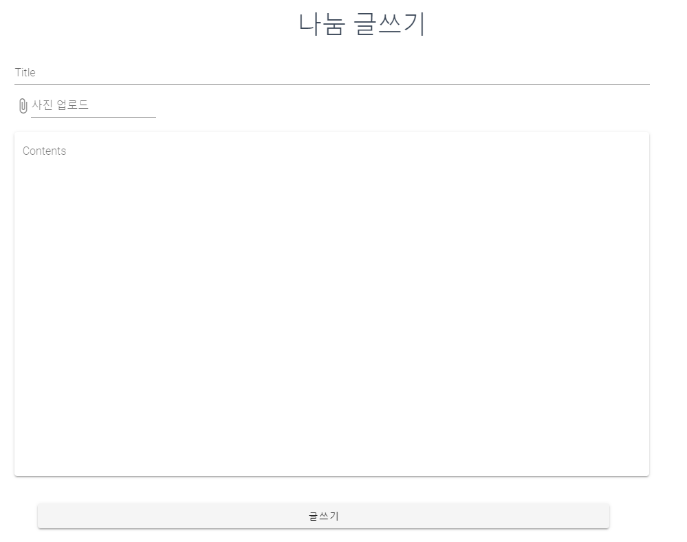
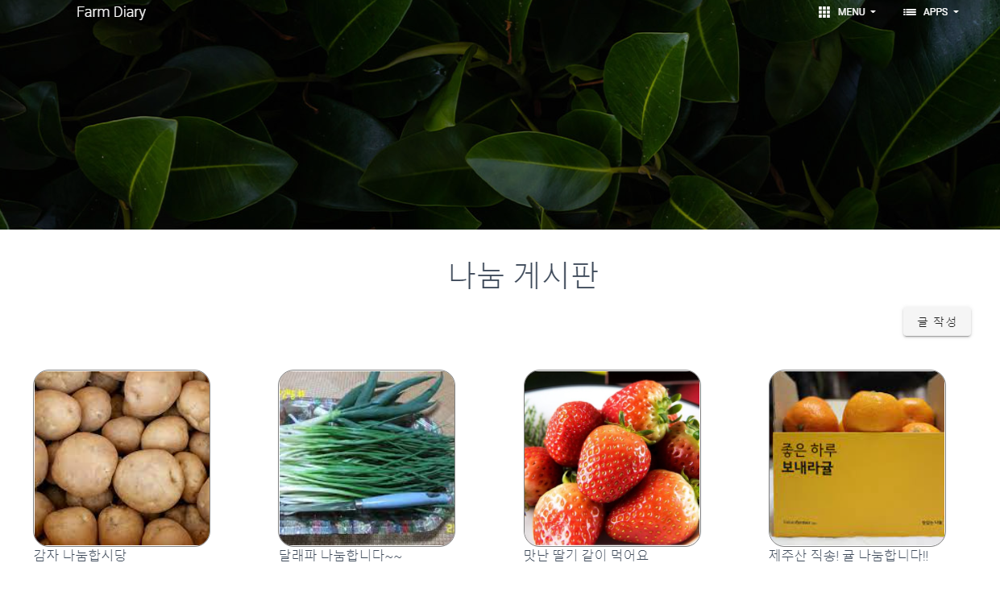
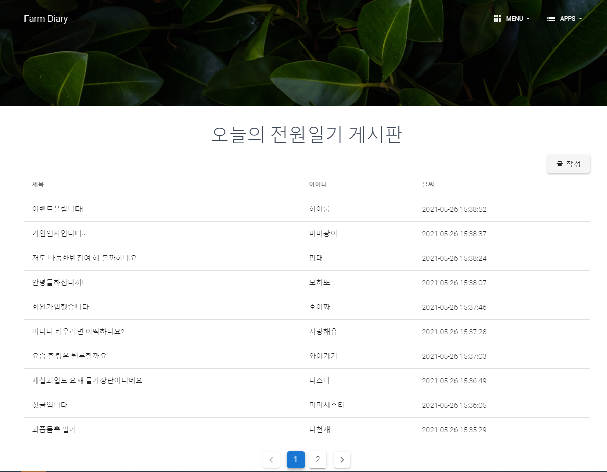
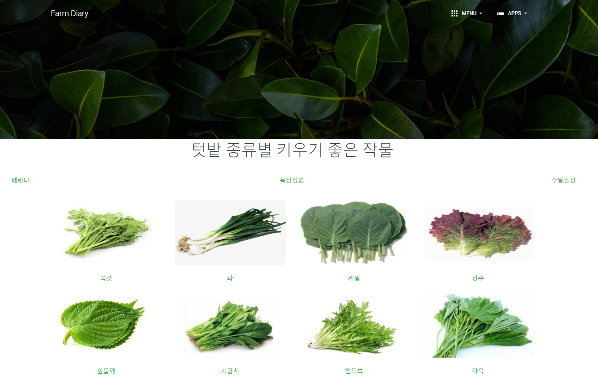
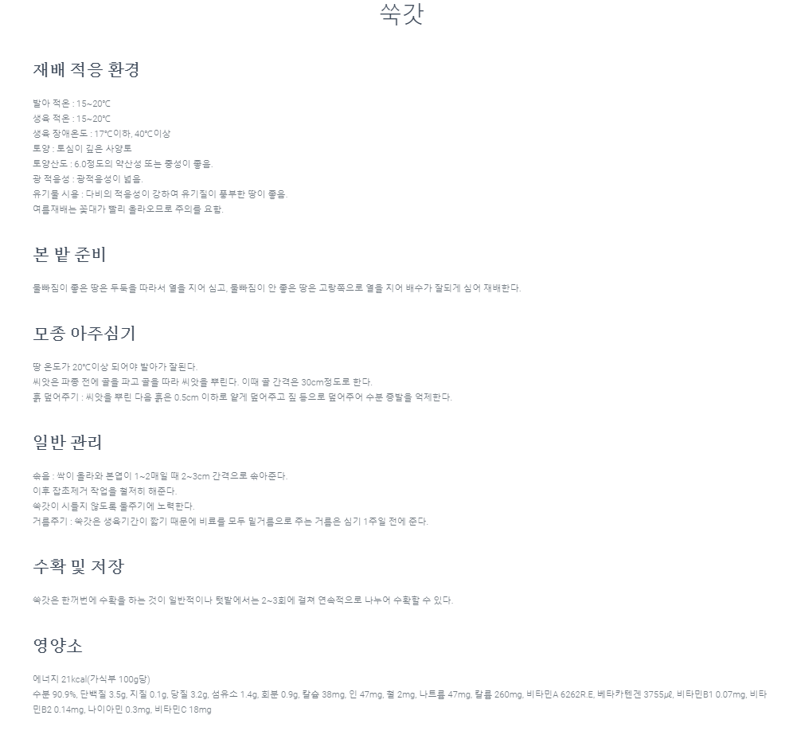
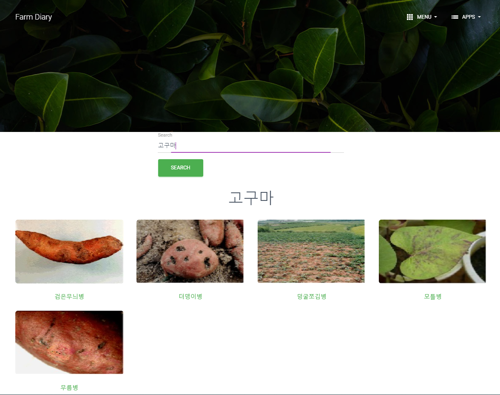

# 전원일기

---

[TOC]

---


## Intro

> 2021년 SSAFY 2학기 자율프로젝트로 `전원일기`라는 도서농업 포털 서비스를 개발하였다.
>
> 개발기간: 2021년 4월 12일 - 2021년 5월 21일
>

### Service

- 병충해 판단을 CNN기반의 MLP를 이용한 AI 알고리즘으로 진단한다.
- 병충해 검색을 통해 병충해 정보와 방제방법 등을 알 수 있다.
- 원예작물 처음 키우는 사람을 위해 장소별 작물별 가이드를 제공한다.
- 사용자간의 **나눔 게시판** 및 **자유게시판** 서비스를 제공한다.

### Compatibility

- Front-end `openjdk 11.0.9.1`, `npm 6.14.10`, `vue/cli 4.5.19` 버전에서 테스트되었다.
- Back-end `python 3.6.8`,`spring boot 2.3.10` 버전에서 테스트 되었다.
- We tested the code using `openjdk 11.0.9.1`, `npm 6.14.10`, `vue/cli 4.5.19`.
- 데이터베이스는 `MongoDB`에서 작성되었다.
- We created database using `MongoDB`
- AWS EC2를 이용하여 프로젝트를  MSA로 서버에 배포하도록 노력하였다.
- Using AWS EC2, I tried to deploy the project to the server as MSA.

## AI(병충해 진단)
- AI폴더 안 **read me** 파일 확인

## 서비스 소개

> `전원일기` 플랫폼에서는 크게 **병충해 진단 및 검색, 나눔 게시판 및 자유 게시판**의 2가지 세부서비스를 제공한다.
>
> - In this platform, users can utilize 2 services of `isease and pest diagnosis and search`,`sharing bulletin board and free bulletin board`

**Main Page**

- 메인 페이지로는 **병충해 진단** 페이지로 이동하는 버튼이 있다.
- 사용자 위치에 따라 **일주일 날씨 정보**를 제공한다.
- Nav Bar를 통해 여러 페이지로 이동가능하다.


### 1. 로그인 페이지

- 아이디와 비밀번호로 로그인이 가능하다.
- 정규식에 맞지 않으면 로그인이 되지 않는다.
- 회원가입으로 이동하는 버튼이 있다.


### 2. 회원가입 페이지

- 아이디, 비밀번호, 비밀번호 확인, 이름, 이메일로 회원가입이 가능하다.
- 정규식에 맞지 않으면 회원가입이 가능하지 않고 아이디 이메일이 존재할 경우 회원가입이 되지 않는다.


### 3. 나눔 게시판

- 텃밭에서 직접 가꾼 작물들을 나눔하며 소통하는 커뮤니티 게시판
- 사진업로드 , 댓글 기능 구현







### 4. 오늘의 전원일기 게시판

- Farm Diary 회원들 간의 소통이 가능 한 커뮤니티 게시판
- 사진업로드 , 댓글 기능 구현





### 5. 가이드 페이지

- 텃밭 종류를 선택하면 해당 텃밭에서 키우기 좋은 작물을 소개합니다.
- 작물을 클릭하면 해당 작물을 키우는 방법에 대하여 알려줍니다.






### 6. 병해충 페이지

- 병해충을 알고싶은 작물을 검색하면 해당 작물의 병해충을 소개합니다.
- 병해충을 클릭하면 해당 병해충을 방지하는 방법에 대하여 알려줍니다.
- 작물 사진을 업로드하면 해당 작물의 병해충 정보를 알려줍니다.





## 설치 안내

> `git clone`을 한 후 아래의 작업을 진행해야 프론트 서버를 실행할 수 있다.

**1단계: yarn 설치**

- `frontend` 프로젝트 폴더에서 yarn을 설치한다.

```bash
yarn install
yarn serve
```

**2단계: 환경변수 설정**

- `frontend` 폴더 내의 최상위 창에서 환경변수 `.env.local`이라는 파일을 생성한다.

- 환경변수로 관리하는 데이터는 다음과 같다.

  ```markdown
  ## .env.local
  
  VUE_APP_SERVER_URL= zuul 서버에 호출하는 주소1
  VUE_APP_SERVER_URL2= zuul 서버에 호출하는 주소2
  ```
> 


## File Manifest

### Frontend

- 폴더 구조는 `views`안에 존재한다.

  ```markdown
  1. Login, Register
  - 로그인 및 회원가입 관련
  2. Index
  - 메인페이지
  3. Board,CreateBoard,ReadBoard
  - 게시판 관련
  4. Guide, Crop 
  - 가이드 관련
  5. CreateSharing, Readsharing, Sharing
  - 나눔 게시판 관련
  6. Pests, PestDetail, PestDiagnosis
  - 병충해 관련
  ```
  
### Backend


 - 폴더구조는 서버 `config-server`,`zuul`,`FarmDiary_Board_Service`,`FarmDiary_Guide_Service`,`FarmDiary_User_Service`로 구성된다.
 - msa형식으로 배포하도록 노력하였다.
 - msa조직도
 


### Database

### ERdiagram


```markdown
- axios
- lodash
- vue bootstrap-vue bootstrap
- less less-loader
- mint-ui -S
- vue-awesome-swiper
- vuetify
- vuex
```


***Copyright* © 2021 SSAFY_SEOUL3_TEAM5_전원일기**

